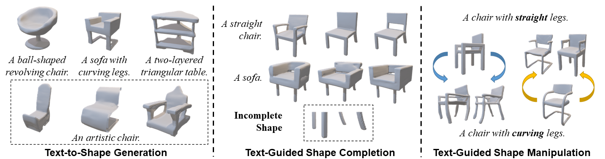

# Diffusion-SDF: Text-to-Shape via Voxelized Diffusion

Created by [Muheng Li](https://ttlmh.github.io/), [Yueqi Duan](https://duanyueqi.github.io/), [Jie Zhou](https://scholar.google.com/citations?user=6a79aPwAAAAJ&hl=en&authuser=1), and [Jiwen Lu](https://scholar.google.com/citations?user=TN8uDQoAAAAJ&hl=en&authuser=1).

We propose a new generative 3D modeling framework called **Diffusion-SDF** for the challenging task of text-to-shape synthesis. We propose a SDF autoencoder together with the Voxelized Diffusion model to learn and generate representations for voxelized signed distance fields (SDFs) of 3D shapes. Specifically, we design a novel UinU-Net architecture that implants a local-focused inner network inside the standard U-Net architecture, which enables better reconstruction of patch-independent SDF representations. We extend our approach to further text-to-shape tasks including text-conditioned shape completion and manipulation. Experimental results show that Diffusion-SDF is capable of generating both high-quality and highly diversified 3D shapes that conform well to the given text descriptions.

[[arXiv]](https://arxiv.org/abs/2212.03293)

## Code
We are planning to release our codes and pre-trained models soon. Stay tuned for the updates!
