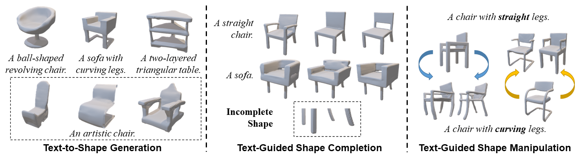

# Diffusion-SDF: Text-to-Shape via Voxelized Diffusion

Created by [Muheng Li](https://ttlmh.github.io/), [Yueqi Duan](https://duanyueqi.github.io/), [Jie Zhou](https://scholar.google.com/citations?user=6a79aPwAAAAJ&hl=en&authuser=1), and [Jiwen Lu](https://scholar.google.com/citations?user=TN8uDQoAAAAJ&hl=en&authuser=1).



We propose a new generative 3D modeling framework called **Diffusion-SDF** for the challenging task of text-to-shape synthesis. Previous approaches lack flexibility in both 3D data representation and shape generation, thereby failing to generate highly diversified 3D shapes conforming to the given text descriptions. To address this, we propose a SDF autoencoder together with the Voxelized Diffusion model to learn and generate representations for voxelized signed distance fields (SDFs) of 3D shapes. Specifically, we design a novel UinU-Net architecture that implants a local-focused inner network inside the standard U-Net architecture, which enables better reconstruction of patch-independent SDF representations. We extend our approach to further text-to-shape tasks including text-conditioned shape completion and manipulation. Experimental results show that Diffusion-SDF is capable of generating both high-quality and highly diversified 3D shapes that conform well to the given text descriptions. Diffusion-SDF has demonstrated its superiority compared to previous state-of-the-art text-to-shape approaches.


[[Project Page]](https://ttlmh.github.io/DiffusionSDF/) [[arXiv]](https://arxiv.org/abs/2212.03293)

## Code

### Installation
To set up the Diffusion-SDF environment, you can use the provided `diffusionsdf.yml` file to create a Conda environment. Follow the steps below:
1. Clone the repository:
```
git clone https://github.com/ttlmh/Diffusion-SDF.git
```
2. Create the Conda environment using the provided YAML file and activate:
```
conda env create -f diffusionsdf.yml
conda activate diffusionsdf
```

### Download Pre-trained Models
Download the SDF auto-encoder model file (vae_epoch-120.pth: [Baidu Disk](https://pan.baidu.com/s/1z0eh8SXSrn8tbq5epo0r6Q?pwd=f1cv) / [Google Drive](https://drive.google.com/file/d/18MxWYf6IItYOxUzdM5LiWb8dr9zSwA-2/view?usp=sharing)) and the Voxelized Diffusion model file (voxdiff-uinu.ckpt: [Baidu Disk](https://pan.baidu.com/s/1Emu5kFVaYbuKIkdCKlghXQ?pwd=q1wv) / [Google Drive](https://drive.google.com/file/d/1yeB0dJGZvIXdF1V1DhI-fRz6CKnGbIwJ/view?usp=sharing))) from the above links. Place the downloaded model files in the directory ```./ckpt``` .

---

## Inference

### Text-to-Shape Generation
To generate 3D shapes from text descriptions using Diffusion-SDF, run:

```
python txt2sdf.py --prompt "a revolving chair" --save_obj
```
The generated 3D shape will be saved as GIF renderings and OBJ files under `outputs/`.

### Text-Conditioned Shape Completion
Given a partial/incomplete 3D shape (as an `.h5` SDF file) and a text prompt, Diffusion-SDF can complete the missing regions:

```bash
# Axial cut: mask out the bottom half along the Z axis
python shape_completion.py \
    --input_sdf path/to/partial.h5 \
    --prompt "a wooden chair" \
    --mask_axis z --mask_ratio 0.5

# SDF-value based masking (mask voxels with SDF >= threshold)
python shape_completion.py \
    --input_sdf path/to/shape.h5 \
    --prompt "a dining table" \
    --mask_type threshold --mask_value 0.0
```
Results (GIF renderings and optional OBJ files) are saved under `outputs/shape_completion/`.

### Text-Conditioned Shape Manipulation
Given an existing 3D shape and a text prompt, Diffusion-SDF modifies the shape via the SDEdit approach — encoding the shape to latent space, adding noise up to a chosen timestep, then denoising with the new text prompt:

```bash
# Moderate manipulation (50% noise strength)
python shape_manipulation.py \
    --input_sdf path/to/shape.h5 \
    --prompt "a chair with a cushion" \
    --strength 0.5

# Strong manipulation (75% noise strength — more creative freedom)
python shape_manipulation.py \
    --input_sdf path/to/shape.h5 \
    --prompt "a modern minimalist chair" \
    --strength 0.75
```
Results are saved under `outputs/shape_manipulation/`, including a rendering of the original shape for comparison.

---

## Training

### Data Preparation

Training requires two things: voxelized SDF files for the 3D shapes, and text captions from Text2Shape.

#### Step 0 — Download ShapeNet Core v1

Register and download [ShapeNet Core v1](https://shapenet.org/) and extract it somewhere (e.g. `data/ShapeNetCore.v1/`).

#### Step 1 — Precompute 64³ SDF volumes

ShapeNet provides triangle meshes; the autoencoder and diffusion model need voxelized signed-distance fields on a 64³ grid, stored as HDF5 files. We follow the same preprocessing pipeline as [SDFusion](https://github.com/yccyenchicheng/SDFusion):

```bash
# Install system dependencies (Ubuntu/Debian)
sudo apt-get install freeglut3-dev libtbb-dev

# Clone SDFusion and run their SDF generation scripts
# (see SDFusion repo for the full launcher scripts)
cd preprocess
bash launch_create_sdf_shapenet.sh \
    --shapenet_root data/ShapeNetCore.v1 \
    --out_root data/ShapeNet/sdf
```

The expected output layout is:
```
data/ShapeNet/
  sdf/
    <synset_id>/          e.g. 03001627 (chair), 04379243 (table)
      <model_id>/
        pc_sdf_sample.h5  float32 array of shape (262144,) = 64³ SDF values
```

The HDF5 key is `pc_sdf_sample` and the array is stored flat (262144 = 64×64×64 elements).

#### Step 2 — Prepare Text2Shape captions

[Text2Shape](http://text2shape.stanford.edu/) provides natural-language descriptions for ShapeNet **chairs** and **tables** only. Other categories will be trained unconditionally (empty caption).

```bash
# Download the caption CSV
mkdir -p data/ShapeNet/text
wget http://text2shape.stanford.edu/dataset/captions.tablechair.csv \
    -O data/ShapeNet/text/captions.tablechair.csv

# Convert to captions.json and generate train/val/test splits
python preprocess/prepare_text2shape.py --data_root data/ShapeNet
```

This produces:
```
data/ShapeNet/
  text/
    captions.tablechair.csv   (raw Text2Shape CSV)
    captions.json             {model_id: [caption, ...]}
  train_models.json           [model_id, ...]
  val_models.json
  test_models.json
```

If you have ShapeNet's official split JSON files, pass them with `--shapenet_split_dir` to use the canonical splits instead of a random split:

```bash
python preprocess/prepare_text2shape.py \
    --data_root data/ShapeNet \
    --shapenet_split_dir data/ShapeNet/splits
```

### Step 1 — Train the SDF Autoencoder
Train the patch-wise variational autoencoder that encodes 64³ SDF volumes into a compact 8³ latent space:

```bash
# Single GPU
python train_ae.py --data_root data/ShapeNet --cat all

# Resume from a checkpoint
python train_ae.py --data_root data/ShapeNet \
    --resume ckpt/vae_epoch-120.pth --start_epoch 121

# Multi-GPU (DDP via torchrun)
torchrun --nproc_per_node=4 train_ae.py --data_root data/ShapeNet --dist_train
```

Checkpoints are saved to `./ckpt/` as `vae_epoch-{N}.pth`.

### Step 2 — Train the Voxelized Diffusion Model
After the AE is trained, train the text-conditioned 3D diffusion model using PyTorch Lightning:

```bash
# Single GPU
python main.py --config configs/voxdiff-uinu.yaml

# Resume from a checkpoint
python main.py --config configs/voxdiff-uinu.yaml --resume /path/to/checkpoint.ckpt

# Multi-GPU
python main.py --config configs/voxdiff-uinu.yaml --gpus 0,1,2,3
```

Checkpoints are saved under `logs/<run_name>/checkpoints/`.

## Acknowledgement
Our code is based on [Stable-Diffusion](https://github.com/CompVis/stable-diffusion), and [AutoSDF](https://github.com/yccyenchicheng/AutoSDF).

## Citation
If you find our work useful in your research, please consider citing:

```
@inproceedings{li2023diffusionsdf,
  author={Li, Muheng and Duan, Yueqi and Zhou, Jie and Lu, Jiwen},
  title={Diffusion-SDF: Text-to-Shape via Voxelized Diffusion},
  booktitle={Proceedings of the IEEE Conference on Computer Vision and Pattern Recognition (CVPR)},
  year={2023}
}
```
